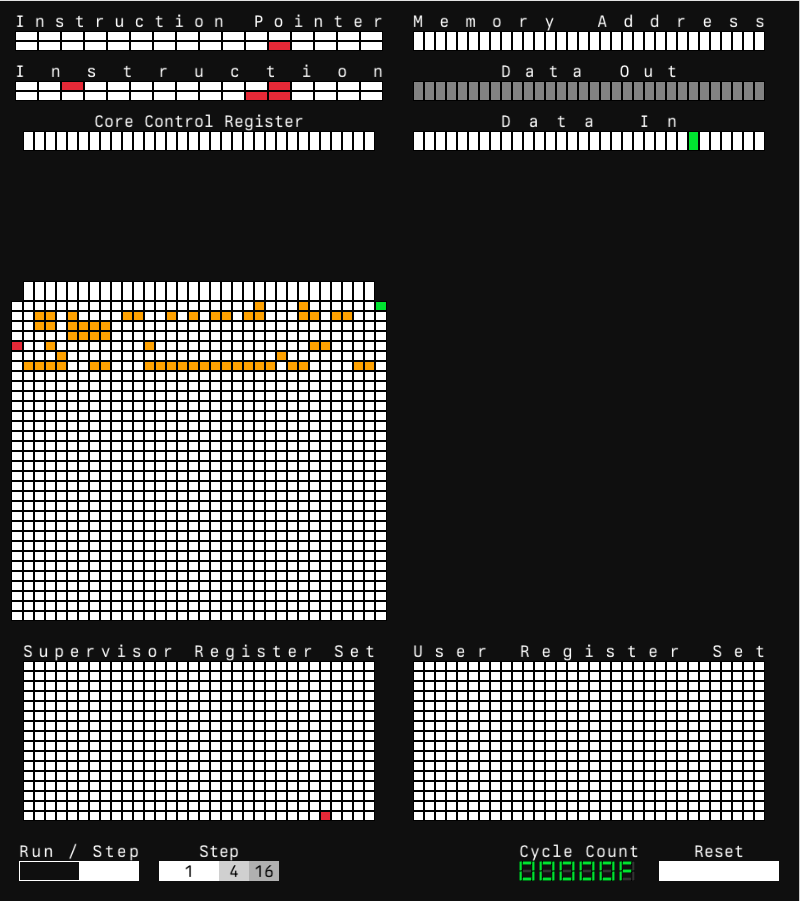
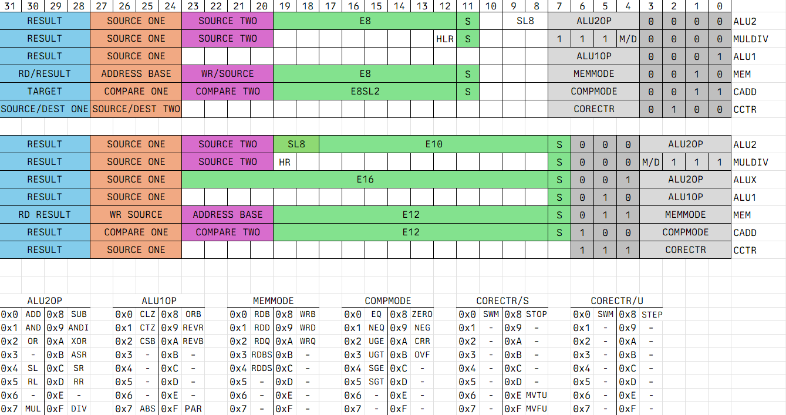

sol32 glasscell is a single core simulator and debugging frontend.
Unfortunately the ISA spec was not completed and this project is now archived. **See [sol32pt](https://github.com/akkaygin/sol32pt) for more information.**

This repo has been made public to show the partial implementation of a CPU core in systemverilog and a visualizer made using raylib. This version cannot be built as I was working on a big rework of the memory subsystem but I attached a screenshot from a time when it worked. I went with a blinkenlight look that put looks(!) before functionality as I initially planned to compile this into wasm and display it on my website. 
And here is a screenshot of two versions of the ISA I planned using Excel :) You can spot issues such as a lot of encoding space being wasted on many insturctions that only operate on registers or there being 16 GPRs available at a time (but there were 2 sets). Problems such as these are addressed in the new and improved version (not public yet!). 